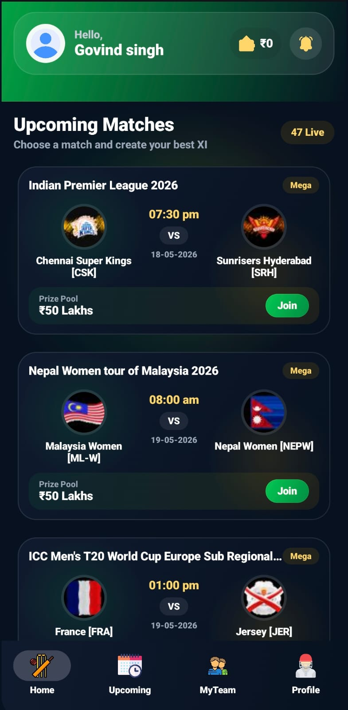
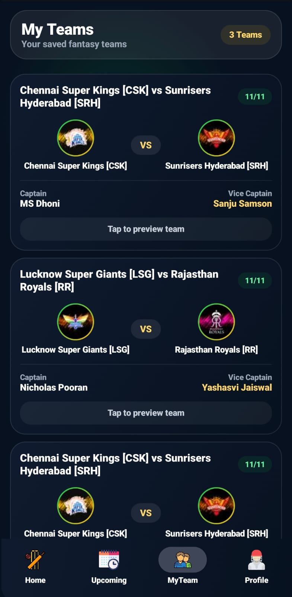
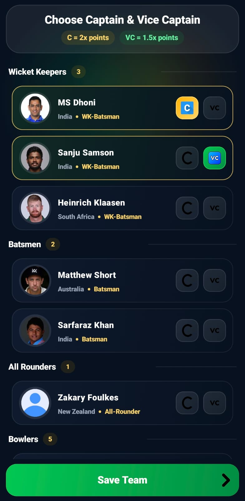
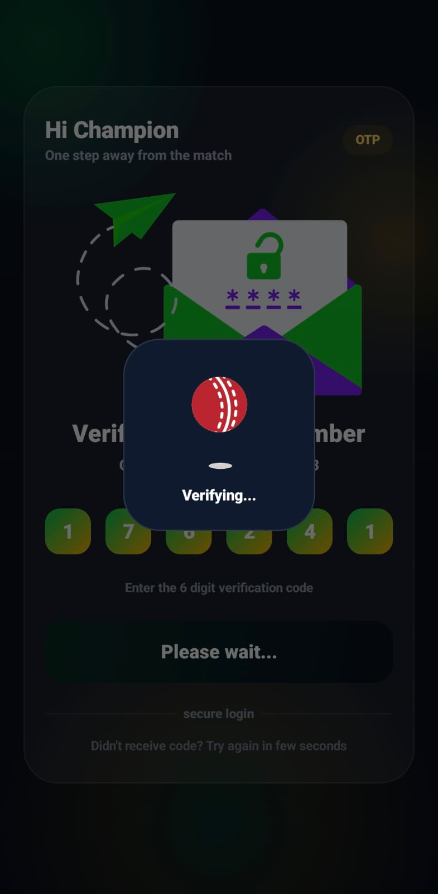
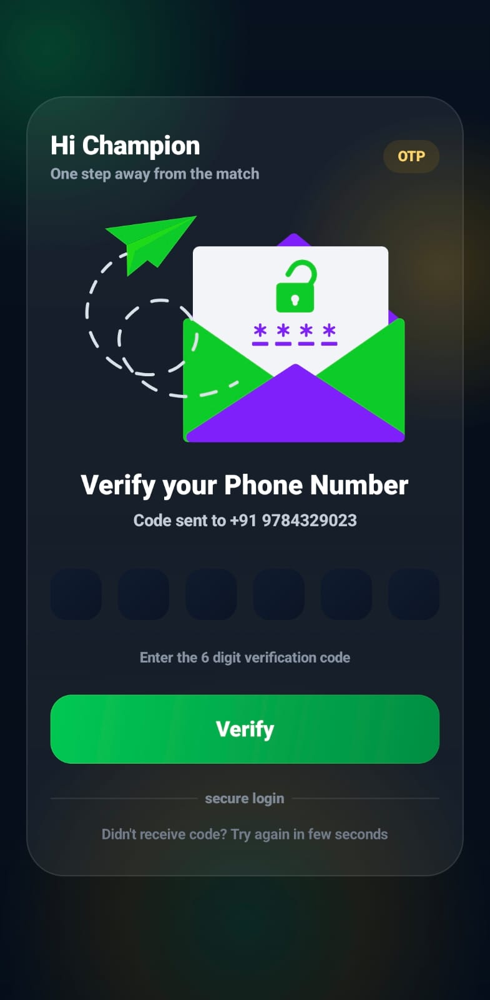
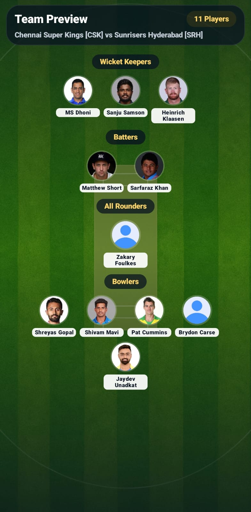
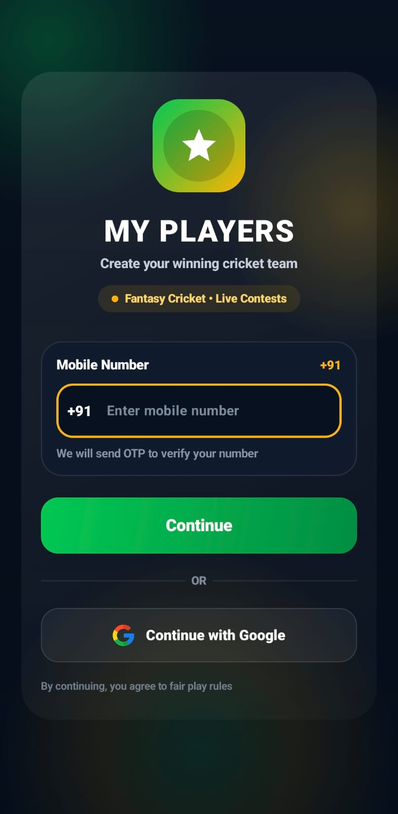
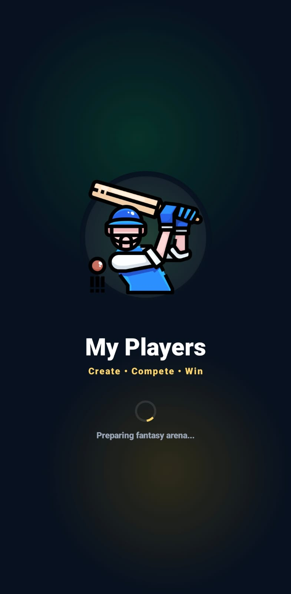

# MyPlayers_UI_FantasyApp
A minimal yet powerful fantasy team builder showcasing modern Android development with Kotlin and Jetpack Compose , Firebase.

## 📸 App Screenshots

<table align="center" cellpadding="10">
<tr>
  <td></td>
  <td></td>
  <td></td>
  <td></td>
  <td></td>
</tr>
<tr>
  <td></td>
  <td></td>
  <td></td>
  <td></td>
  <td></td>
</tr>
<tr>
</tr>
</table>

